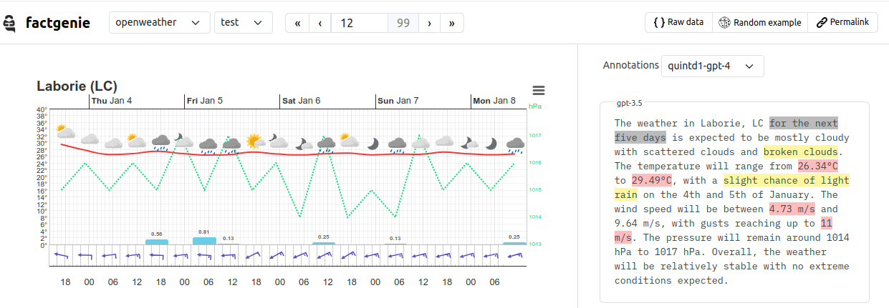

# factgenie


<!--  -->
<!--  -->

Visualize and annotate LLM outputs 🌈



## 📢  News
- **09/08/2024** - Instructions for the annotators can be now configured directly in the web interace and in the configuration file – no need for coding HTML!
- **31/07/2024** - We updated and expanded the README into a set of tutorials. The tutorials are available on our [Github wiki](../../wiki/).
- **31/07/2024** - We substantially improved the data management. You can now manage the datasets both through the configuration file and the web interface.
- **25/07/2024** - We published an [arXiv pre-print](https://arxiv.org/abs/2407.17863) about factgenie. The paper is accepted to the INLG 2024 System Demonstrations track.

## 👉️ How can factgenie help you?
Outputs from large language models (LLMs) may contain errors: semantic, factual, and lexical. 

With factgenie, you can have the error spans annotated:
- From LLMs through an API.
- From humans through a crowdsourcing service.

Factgenie can provide you:
1. **A user-friendly website** for collecting annotations from human crowdworkers.
2. **API calls** for collecting equivalent annotations from LLM-based evaluators.
3. **A visualization interface** for visualizing the data and inspecting the annotated outputs.

---
*What does factgenie **not help with** is collecting the data or model outputs (we assume that you already have these), starting the crowdsourcing campaign (for that, you need to use a service such as [Prolific.com](https://prolific.com)) or running the LLM evaluators (for that, you need a local framework such as [Ollama](https://ollama.com) or a proprietary API).*

## 🏃 Quickstart
Make sure you have Python 3 installed (the project is tested with Python 3.10).

After cloning the repository, the following commands install the package and start the web server:
```
pip install -e .
factgenie run --host=127.0.0.1 --port 5000
```

## 💡 Usage guide


See the following **wiki pages** that that will guide you through various use-cases of factgenie:

| Topic                                                                  | Description                                       |
| ---------------------------------------------------------------------- | ------------------------------------------------- |
| 🔧 [Setup](../../wiki/01-Setup)                                         | How to install factgenie.                         |
| 🗂️ [Data Management](../../wiki/02-Data-Management)                     | How to manage datasets and model outputs.         |
| 🤖 [LLM Annotations](../../wiki/03-LLM-Annotations)                     | How to annotate outputs using LLMs.               |
| 👥 [Crowdsourcing Annotations](../../wiki/04-Crowdsourcing-Annotations) | How to annotate outputs using human crowdworkers. |
| 🧑‍💻 [Developer Notes](../../wiki/05-Developer-Notes)                     | How to contribute to the framework.               |

 
We provide multiple examples for you to get inspired when preparing your own experiments. In simple cases, you can even get without writing Python code completely!

## 💬 Cite us
You can find our paper on [arXiv](https://arxiv.org/abs/2407.17863).

The paper is also accepted for INLG 2024 System Demonstrations.

For citing us, please use the following BibTeX entry:
```bibtex
@misc{kasner2024factgenie,
      title     = {factgenie: A Framework for Span-based Evaluation of Generated Texts}, 
      author    = {Zdeněk Kasner and Ondřej Plátek and Patrícia Schmidtová and Simone Balloccu and Ondřej Dušek},
      year      = {2024},
      booktitle = {Proceedings of the 17th International Natural Language Generation Conference (System Demonstrations)},
      note      = {To appear},
      url       = {https://arxiv.org/abs/2407.17863}, 
}
```

## Acknowledgements
This work was co-funded by the European Union (ERC, NG-NLG, 101039303).
 