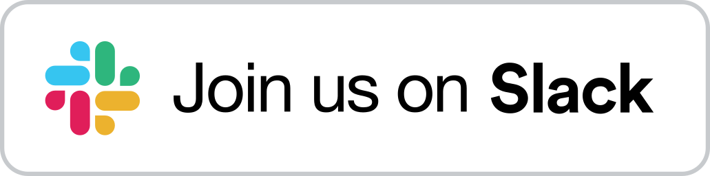

<div align="center">


<h1> factgenie </h1>

<!--  -->


[](https://join.slack.com/t/factgenie/shared_invite/zt-2u180yy81-3zCR7mt8EOy55cxA5zhKyQ)
[](https://github.com/psf/black)

<!-- [](https://arxiv.org/abs/2407.17863) -->
<!--  -->

Annotate LLM outputs with a lightweight, self-hosted web application 🌈


</div>

## 📢  News
- **2025-03-06** - Release 1.1.0 is out and comes with many significant improvements! See the 👉️ [changelog](https://github.com/ufal/factgenie/releases/tag/v1.1.0).
- **2024-11-13** - We released version 1.0.1: our first official release! 🎉

## 👉️ How can factgenie help you?
Outputs from large language models (LLMs) may contain errors: semantic, factual, and lexical. 

With factgenie, you can have the error spans annotated:
- From LLMs through an API.
- From humans through a crowdsourcing service.

Factgenie can provide you:
1. **A user-friendly website** for collecting annotations from human crowdworkers.
2. **API calls** for collecting equivalent annotations from LLM-based evaluators.
3. **A visualization interface** for visualizing the data and inspecting the annotated outputs.

---
*What does factgenie **not help with** is collecting the data (we assume that you already have these), starting the crowdsourcing campaign (for that, you need to use a service such as [Prolific.com](https://prolific.com)) or running the LLM evaluators (for that, you need a local framework such as [Ollama](https://ollama.com) or a proprietary API).*

## 🏃 Quickstart
Make sure you have Python >=3.9 installed.

If you want to quickly try out factgenie, you can install the package from PyPI:
```bash
pip install factgenie
```

However, the recommended approach for using factgenie is using an editable package:
```bash
git clone https://github.com/ufal/factgenie.git
cd factgenie
pip install -e .[dev,deploy]
```
This approach will allow you to manually modify configuration files and write your own data classes.

After installing factgenie, use the following command to run the server on your local computer:
```bash
factgenie run --host=127.0.0.1 --port 8890
```
More information on how to set up factgenie is on [Github wiki](../../wiki/Setup).

## 💡 Usage guide


See the following **wiki pages** that that will guide you through various use-cases of factgenie:

| Topic                                                               | Description                                        |
| ------------------------------------------------------------------- | -------------------------------------------------- |
| 🔧 [Setup](../../wiki/Setup)                                         | How to install factgenie.                          |
| 🗂️ [Data Management](../../wiki/Data-Management)                     | How to manage datasets and model outputs.          |
| 🤖 [LLM Annotations](../../wiki/LLM-Annotations)                     | How to annotate outputs using LLMs.                |
| 👥 [Crowdsourcing Annotations](../../wiki/Crowdsourcing-Annotations) | How to annotate outputs using human crowdworkers.  |
| ✍️  [Generating Outputs](../../wiki/Generating-Outputs)              | How to generate outputs using LLMs.                |
| 📊 [Analyzing Annotations](../../wiki/Analyzing-Annotations)         | How to obtain statistics on collected annotations. |
| 💻 [Command Line Interface](../../wiki/CLI)                          | How to use factgenie command line interface.       |
| 🌱 [Contributing](../../wiki/Contributing)                           | How to contribute to factgenie.                    |

## 🔥 Tutorials
We also provide step-by-step walkthroughs showing how to employ factgenie on [the dataset from the Shared Task in Evaluating Semantic Accuracy](https://github.com/ehudreiter/accuracySharedTask):

| Tutorial                                                                                                                    | Description                                                                                      |
| --------------------------------------------------------------------------------------------------------------------------- | ------------------------------------------------------------------------------------------------ |
| [🏀 #1: Importing a custom dataset](../../wiki/Tutorials#-tutorial-1-importing-a-custom-dataset)                             | Loading the basketball statistics and model-generated basketball reports into the web interface. |
| [💬 #2: Generating outputs](../../wiki/Tutorials#-tutorial-2-generating-outputs)                                             | Using Llama 3.1 with Ollama for generating basketball reports.                                   |
| [📊 #3: Customizing data visualization](../../wiki/Tutorials#-tutorial-3-customizing-data-visualization)                     | Manually creating a custom dataset class for better data visualization.                          |
| [🤖 #4: Annotating outputs with an LLM](../../wiki/Tutorials#-tutorial-4-annotating-outputs-with-an-llm)                     | Using GPT-4o for annotating errors in the basketball reports.                                    |
| [👨‍💼 #5: Annotating outputs with human annotators](../../wiki/Tutorials#-tutorial-5-annotating-outputs-with-human-annotators) | Using human annotators for annotating errors in the basketball reports.                          |

## 🔊 Join us on Slack

If you want to get a quick feedback or actively participate in development of factgenie, join our public **Slack workspace**:

<a href="https://join.slack.com/t/factgenie/shared_invite/zt-2u180yy81-3zCR7mt8EOy55cxA5zhKyQ"></a>

## 📸 Try a public preview
We used factgenie for [our related research project](https://d2t-llm.github.io/). We host the outputs from the project using a public instance of factgenie.

> [!IMPORTANT]
> Note that this preview is very limited: it enables only data viewing, not any data collection or management.

**👉️ You can access the preview [here](https://quest.ms.mff.cuni.cz/nlg/d2t-llm/)**.

## 💬 Cite us

[Our paper](https://aclanthology.org/2024.inlg-demos.5/) was published at INLG 2024 System Demonstrations!

You can also find the paper on [arXiv](https://arxiv.org/abs/2407.17863).

For citing us, please use the following BibTeX entry:
```bibtex
@inproceedings{kasner2024factgenie,
    title = "factgenie: A Framework for Span-based Evaluation of Generated Texts",
    author = "Kasner, Zden{\v{e}}k  and
      Platek, Ondrej  and
      Schmidtova, Patricia  and
      Balloccu, Simone  and
      Dusek, Ondrej",
    editor = "Mahamood, Saad  and
      Minh, Nguyen Le  and
      Ippolito, Daphne",
    booktitle = "Proceedings of the 17th International Natural Language Generation Conference: System Demonstrations",
    year = "2024",
    address = "Tokyo, Japan",
    publisher = "Association for Computational Linguistics",
    url = "https://aclanthology.org/2024.inlg-demos.5",
    pages = "13--15",
}
```

## Acknowledgements
This work was co-funded by the European Union (ERC, NG-NLG, 101039303).

 
