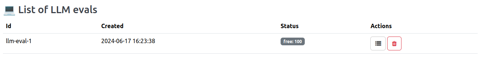
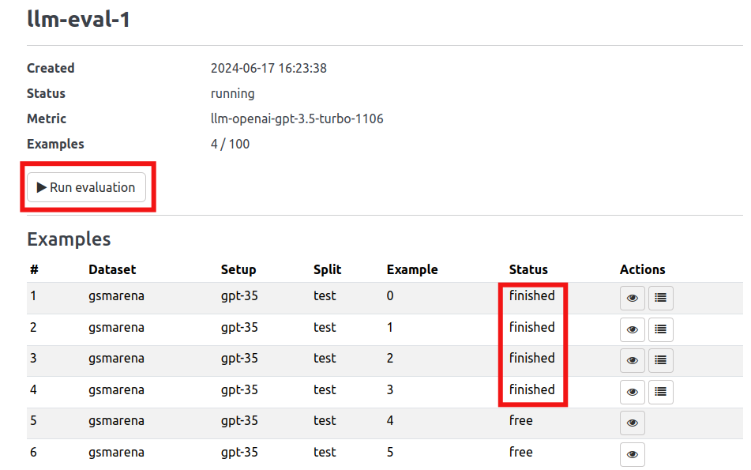
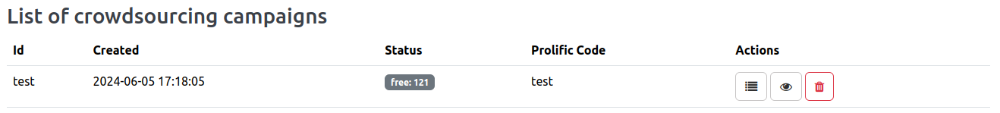
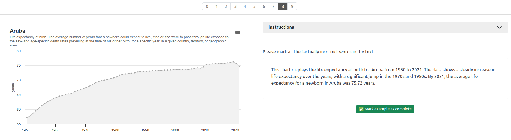
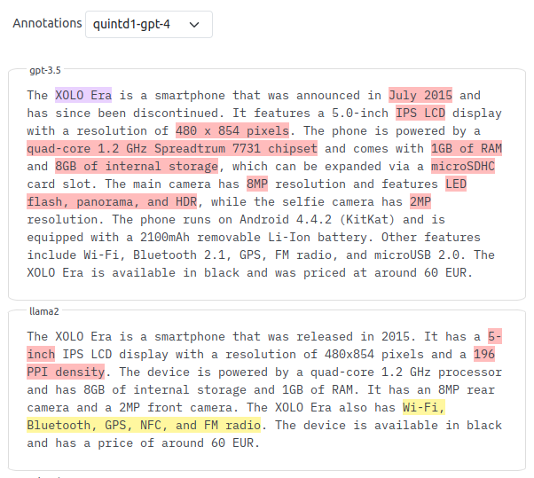

# factgenie


<!--  -->
<!--  -->

Visualize and annotate errors in LLM outputs.

🚧 **The project is in progress; use at your own risk.** 🚧


## Intro
Outputs from large language models (LLMs) may contain errors: semantic, factual, and lexical. 

With **factgenie**, you can have the errors highlighted 🌈:
- From humans through a crowdsourcing service.
- From LLMs through an API.

How does **factgenie** help with that?
1. It helps you **create a user-friendly website** for collecting annotations from human crowdworkers.
2. It helps you with **LLM API calls** for collecting equivalent annotations from LLM-based evaluators.
3. It provides you with **visualization interface** for inspecting the annotated outputs.

What does factgenie **not help with** is collecting the data or model outputs (we assume that you already have these), starting the crowdsourcing campaign (for that, you need to use a service such as [Prolific.com](https://prolific.com)) or running the LLM evaluators (for that, you need a local framework such as [Ollama](https://ollama.com) or a proprietary API).

---
*This project is a framework and template for you, dear researcher. Help us improve it! :wink:*
----

## Quickstart
Make sure you have Python 3 installed (the project is tested with Python 3.10).

The following commands install the package, start the web server, and open the front page in the browser:
```
pip install -e .
factgenie run --host=127.0.0.1 --port 5000
xdg-open http://127.0.0.1:5000  # for Linux it opens the page for you
```

### Using Docker

The `Dockerfile` included in the project will run `factgenie` using Python 3.10 exposing the app on port 80. You can run the server by executing

```
# Build the factgenie Docker image
docker build --tag 'factgenie' .
# Run the image in detached mode with in-container port 80 exposed as localhost:8080
docker run -p 8080: 80 --detach 'factgenie'
```

You can then access the server by navigating to `localhost:8080` in your browser.

The included `docker-compose.yml` file can be used to launch the server using `docker compose up` if you so desire. Simply drop `docker-compose.yml` one directory up from the root directory for the repository, navigate to that directory, and run the command. For example, if you haven't moved the file yet and you're in the root of the repo, you can run:

```
# Copy the folder one level up
cp docker-compose.yml ../.
# Navigate one level up
cd ..
# Run docker compose in detached mode
docker compose up -d
```

## Step-by-step guide
Each project is unique. That is why this **framework is partially DIY**: we assume that it will be customized for a particular use case.

### 0) Setup Dependencies
The `factgenie` uses [ollama](https://ollama.com/) to run local LLMs and [openai-python](https://github.com/openai/openai-python) API to OpenAI LLMs to gather annotations.
For crowdsourcing campaigns, it was designed to easily integrate into [prolific.com](https://prolific.com) workflow.

Read their documentation to set it up, we will prepare step-by-step guides in the future.

For setting up the LLMs for annotation, the `factgenie` needs just the `ollama` or `openai` URL to connect to.
From Prolific, one needs to obtain a completion code, which will be displayed to the annotators as proof of completed work for the [prolific.com](https://researcher-help.prolific.com/hc/en-gb/articles/360009223173-Data-collection#h_01HDJXW21T4R05T9YTD10GKMXY)

### 1) Gather your inputs and outputs

Make sure you have **input data** and corresponding **model outputs** from the language model. 


By input data, we mean anything that will help the annotators with assessing the factual accuracy of the output. 

See the [factgenie/data](factgenie/data) folder for example inputs and the [factgenie/outputs](factgenie/outputs) folder for example model outputs.

The input data can have any format visualizable in the web interface - anything from plain text to advanced charts. The model outputs should be in plain text. 

### 2) Prepare a data loader
Write a data loader class for your dataset. The class needs to subclass the `Dataset` class in [factgenie/loaders/dataset.py](factgenie/loaders/dataset.py) and implement its methods.

Notably, you need to implement:
- `load_data()` for loading the input data,
- `load_generated_outputs()` for loading the model outputs,
- `render()` for rendering the inputs in HTML,
- `get_info()` returning information about your dataset.

You can get inspired by the example datasets in [factgenie/loaders/dataset.py](factgenie/loaders/dataset.py).

### 3) Run the web interface

To check that everything works as expected, fire up the web interface 🔥


First, install the Python package (the project is tested with Python 3.10):
```
pip install -e .
```
Start the local web server:
```
factgenie run --host=127.0.0.1 --port 8890
```

After opening the page http://127.0.0.1:8890 in your browser, you should be able to see the front page:


Go to `/browse`. Make sure that you can select your dataset in the navigation bar and browse through the examples.

### 4) Annotate the outputs with LLMs
For collecting the annotations from an LLM, you will first need to get access to one. The options we recommend are:

- [OpenAI API](https://openai.com/api/): After you create an account, set the `OPENAI_API_KEY` environment variable to your API key. Note that you will need to pay per token for the service.
- [Ollama](https://ollama.com): An open-source framework for running LLMs locally. After you start the model, create a config file in `factgenie/config/llm-eval` with the respective API URL (see `factgenie/llm-eval/config/ollama-llama3.yaml` for an example).

In general, you can integrate factgenie with any API that allows decoding responses as JSON (or any API as long as you can get a JSON by postprocessing the response).

You also need to customize the YAML configuration file in `factgenie/config/llm-eval` by setting the model prompt optionally along with the system message, model parameters, etc.
Keep in mind the prompt needs to **ask the model to produce JSON outputs in the following format**:
```
{
  "errors": [
    { 
      "text": [TEXT_SPAN],
      "type": [ANNOTATION_SPAN_CATEGORY]},
    ...
  ]
}
```
The provided examples should help you with setting up the prompt.

Once you have the configuration file ready, you should:
- Go to factgenie `/llm_eval` webpage.
- Click on **New LLM eval** and select the campaign identifier.
- In the **Data** section:
  - Select the datasets and splits you want to annotate. 
- In the **LLM config** section:
  - Select your customized configuration file.
- In the **Error categories** section:
  - Select the error categories you specified in the prompt.

Your eval should appear in the list:



Now you need to go to the campaign details and run the evaluation. The annotated examples will be marked as `finished`:



### 5) Annotate the outputs with human crowd workers


For collecting the annotations from human crowd workers, you typically need to:
- prepare **user-friendly web interface** for collecting the annotations  ,
- **monitor the progress** of the crowdworkers.

👉️ With factgenie, you won't need to spend almost any time with any of these!

---
❗️ **Important:** you should password-protect the application when you are running a human evaluation campaign so that annotators cannot access other pages. 

To enable authentication for all the pages except for the annotation page, go to `factgenie/config.yml` and set:
 - `login.active: true`
 - `login.username: YOUR_USERNAME`
 - `login.password: YOUR_PASSWORD`
---

#### Starting a campaign
First, we will **start a new campaign**:
- Go to `/crowdsourcing`.
- Click on **New Campaign** and select the campaign identifier.
- In the **Data** section:
  - Select the datasets and splits you want to annotate. 
  - **Examples per batch**: the number of examples the annotator will see,
  - **Group outputs**: whether you want to shuffle all the available outputs (`Random`) or keep the outputs grouped by input examples (`Example-wise (shuffled)`).
- In the **Prolific** section:
  - **Idle time**: number of minutes after which an assigned example will be freed and offered to a new annotator
  - **Prolific completion code**: the code that will appear to the annotator after the annotation is completed.
- In the **Error categories** section:
  - Select which error categories you want the annotators to annotate along with the corresponding colors.

Your campaign should appear in the list:



You can now preview the annotation page by clicking on the 👁️‍🗨️ icon. If a crowd worker opens this page, the corresponding batch of examples will be assigned to them.

Since we are using the dummy `PROLIFIC_PID` parameter (`test`), we can preview the page and submit annotations without having this particular batch assigned.

#### Customizing the annotation page
**And now it's your turn.** To customize the annotation page, go to `factgenie/templates/campaigns/<your_campaign_id>` and modify the `annotate.html` file. 

You will typically need to write custom instructions for the crowd workers, include Javascript libraries necessary for rendering your inputs, or write custom Javascript code.

You can get inspired by the example campaign in `factgenie/templates/campaigns/`.

Submit the annotations from the Preview page (and delete the resulting files) to ensure that everything works from your point of view.





#### Launch the crowdsourcing campaign
By clicking on the **Details** button, you can get the link that you can paste on Prolific. By now, you need to run the server with a public URL so that it is accessible to the crowdworkers.

On the details page, you can monitor how individual batches get assigned and completed.

### 6) View the results
Once the annotations are collected, you can view them on the `/browse`. The annotations from each campaign can be selected in the drop-down menu above model outputs.




## Core Developers 

### Optional use of Git Large File Storage (git lfs)
- We use `git lfs` for storing instructional videos and it is useful for storing any large artefacts.
- We would like to keep the `git lfs` completely optional. As a consequence, we ask you not to commit any large files that are required for running _factgenie_, i.e., use it just for documentation.
- Links to `git lfs` documentation:
   - [Git LFS configuration](https://docs.github.com/en/repositories/working-with-files/managing-large-files/configuring-git-large-file-storage)
   - [Moving a large file from git to git lfs](https://docs.github.com/en/repositories/working-with-files/managing-large-files/moving-a-file-in-your-repository-to-git-large-file-storage)
   - [Does every user need to use git lfs (no)](https://github.com/git-lfs/git-lfs/discussions/4644)
